# Mars Rover Audio Filtering

A digital signal processing project that analyses and filters a noisy audio recording captured by **NASA's Perseverance Rover on Mars**.

The project uses frequency-domain analysis, an FFT-based low-pass filtering approach and a **5th-order Butterworth filter** to reduce high-frequency noise. The processed signal is then compared with NASA's filtered version of the recording.

[](https://colab.research.google.com/drive/1YELvXgNyp7uY6pKm1Ii3RU7G60pzD1Gc)

**[Open the complete project in Google Colab](https://colab.research.google.com/drive/1YELvXgNyp7uY6pKm1Ii3RU7G60pzD1Gc)**

> **Audio playback:** GitHub can display the notebook code, plots and saved outputs, but the interactive audio players are not reliably playable through GitHub's notebook viewer. Open the project in **Google Colab** to listen to the original, NASA-filtered and final processed audio.

---

## Project Overview

The aim of this project is to apply digital signal processing techniques to a noisy Mars audio recording and investigate methods for reducing unwanted high-frequency noise.

The notebook follows the signal from its original time-domain waveform through frequency analysis, filter design and final comparison.

The project demonstrates:

- Audio signal loading and playback
- Time-domain waveform analysis
- Fast Fourier Transform (FFT)
- Frequency-domain analysis
- Low-pass filter design
- Inverse Fast Fourier Transform (IFFT)
- Impulse-response truncation
- Convolution
- Butterworth filtering
- Comparison of processed and reference audio
- Interactive audio playback in Google Colab

---

## Tech Stack

| Technology | Purpose |
|---|---|
| Python | Project implementation |
| NumPy | FFT, IFFT and numerical signal processing |
| SciPy | Butterworth filter design and filtering |
| Matplotlib | Signal and frequency-domain visualisation |
| SoundFile | Reading WAV audio files |
| Librosa | Audio duration handling |
| IPython Audio | Interactive audio playback |
| Google Colab | Development and execution environment |
| Google Drive | Audio-file storage |

---

## Project Workflow

```mermaid
flowchart LR
    A[Raw Mars Audio] --> B[Plot Time-Domain Signal]
    B --> C[FFT Frequency Analysis]
    C --> D[Design 10 kHz Low-Pass Filter]
    D --> E[IFFT to Impulse Response]
    E --> F[Truncate Impulse Response]
    F --> G[Convolve with Audio]
    G --> H[Evaluate Initial Result]
    H --> I[Apply 5th-Order Butterworth Filter]
    I --> J[Compare with NASA Filtered Audio]
    J --> K[Listen to Final Audio in Colab]
```



---

## Audio Analysis

The raw WAV file is loaded using `soundfile`, while `librosa` is used to determine its duration.

The original waveform is first plotted against time to inspect the recorded signal.

```python
x, fs = sf.read(
    '/content/drive/MyDrive/Colab Notebooks/dsp/CW/'
    'Sounds-of-Mars_first-sounds-raw.wav'
)
```

The original recording can then be played directly inside the notebook:

```python
Audio(x.T, rate=fs)
```

---

## Frequency-Domain Analysis

The project uses NumPy's Fast Fourier Transform to convert the signal from the time domain into the frequency domain:

```python
X = np.fft.fft(x)
X_pow = np.abs(X) ** 2
```

The positive and negative frequency components are plotted to inspect the signal spectrum and identify a suitable filtering region.

Based on this analysis, **10 kHz** is selected as the cutoff frequency for the initial low-pass filter.

---

## Initial Low-Pass Filter

A frequency-domain transfer function is created to retain frequencies between approximately **-10 kHz and +10 kHz**.

For positive frequencies:

```python
H_pos = 1. * (f_pos <= 10000)
```

For negative frequencies:

```python
H_neg = 1. * (f_neg >= -10000)
```

The two halves are combined to form the complete frequency response.

```python
H = np.concatenate([H_pos, H_neg])
```

---

## Impulse Response and Convolution

The filter is converted back into the time domain using the Inverse Fast Fourier Transform:

```python
h = np.real(np.fft.ifft(H))
```

The impulse response is then truncated using **200 samples from each end**:

```python
h_trunc = np.concatenate([h[-200:], h[:200]])
```

This truncated impulse response is convolved with the audio signal:

```python
y = np.convolve(x[:, 0], h_trunc)
```

The FFT of the resulting signal is calculated again so the filtered frequency spectrum can be inspected.

---

## Initial Filtering Result

Although the 10 kHz cutoff was selected from the frequency-domain plots, the notebook observes that the resulting audio still sounds very similar to the original recording.

The original and filtered waveforms are therefore plotted side by side for comparison.

Because the first filtering approach did not produce a sufficiently noticeable audible change, the project proceeds to a **Butterworth filter**.

---

## Butterworth Filtering

A **5th-order low-pass Butterworth filter** is designed using SciPy.

```python
wn = 0.01

b, a = butter(5, wn)
z = lfilter(b, a, y)
```

Here, `wn = 0.01` is the normalized cutoff frequency supplied to `scipy.signal.butter`, relative to the Nyquist frequency.

The Butterworth-filtered signal is stored as `z` and plotted alongside the signal from the previous filtering stage.

---

## Comparison with NASA Filtered Audio

The notebook also loads NASA's filtered version of the same recording:

```python
nasa, fs = sf.read(
    '/content/drive/MyDrive/Colab Notebooks/dsp/CW/'
    'Sounds-of-Mars_first-sounds-filtered.wav'
)
```

The project's final filtered waveform is plotted alongside the NASA-filtered waveform to provide a visual comparison.

The notebook then provides separate audio players for:

- The original Mars recording
- NASA's filtered recording
- The final filtered signal produced by the project

For the full comparison, open the notebook in **Google Colab**, where the audio outputs can be played interactively.

---

## Filter Parameters

| Parameter | Value |
|---|---:|
| Initial low-pass cutoff | 10,000 Hz |
| Impulse-response truncation | 200 samples from each end |
| Butterworth filter order | 5 |
| Butterworth normalized cutoff (`wn`) | 0.01 |

---

## Key Observations

The project demonstrates an iterative signal-processing workflow rather than assuming that the first filter design will produce the desired result.

The main observations from the notebook are:

- FFT analysis is used to inspect the frequency content of the noisy recording.
- A 10 kHz low-pass cutoff is selected from the frequency-domain plots.
- The initial FFT/IFFT-based filtering stage produces little noticeable audible change.
- A 5th-order Butterworth low-pass filter is therefore applied as an additional filtering stage.
- The final processed waveform is compared with NASA's filtered version.
- Listening to the different signals is an important part of evaluating the result, making the Colab version particularly useful.

---

## Key Skills Demonstrated

### Digital Signal Processing

- Fast Fourier Transform
- Inverse Fast Fourier Transform
- Frequency-domain analysis
- Low-pass filter design
- Impulse-response analysis
- Convolution
- Butterworth filtering
- Time-domain and frequency-domain interpretation

### Python

- NumPy
- SciPy
- Matplotlib
- SoundFile
- Librosa
- IPython audio tools

### Audio Processing

- WAV file loading
- Sampling-frequency handling
- Waveform visualisation
- Frequency-spectrum analysis
- Digital filtering
- Audio playback and comparison

---

## Repository Structure

```text
mars-rover-audio-filtering/
│
├── README.md
├── Mars_Rover_Audio_Filtering.ipynb
└── .gitignore
```

---

## Run the Project

The recommended way to view and run this project is in **Google Colab**:

### [Open Mars Rover Audio Filtering in Google Colab](https://colab.research.google.com/drive/1YELvXgNyp7uY6pKm1Ii3RU7G60pzD1Gc)

> **Note:** You may need to sign in to a Google account to run the notebook.
> If it opens in read-only mode, select **File → Save a copy in Drive**
> to create an editable version.

The project uses two WAV files:

- [Raw Mars recording](https://drive.google.com/file/d/1kdfntOBQjIwarmfpwXMM_yQP_TeP8477/view?usp=sharing)
- [NASA-filtered recording](https://drive.google.com/file/d/1PVQRvvS6KUi8dDcBHdG4YTQRuN929JMF/view?usp=sharing)

If the files are saved in a different Google Drive location, update the file
paths in the notebook before running the relevant cells.

### GitHub Notebook

The notebook can also be viewed directly on GitHub:

[View the notebook on GitHub](mars_rover_audio_filtering.ipynb)

GitHub is useful for reviewing the code and plots, but **Google Colab is recommended for this project because the audio playback cells are an important part of the analysis**.

---

## Possible Improvements

Potential extensions to the project include:

- Adding quantitative comparisons between the original and filtered signals
- Comparing additional filter types and cutoff frequencies
- Plotting filter frequency responses
- Adding spectrogram analysis
- Calculating signal-to-noise metrics
- Processing both audio channels consistently
- Packaging the filtering workflow into reusable functions
- Allowing audio files to be uploaded directly to Colab instead of relying on fixed Google Drive paths
